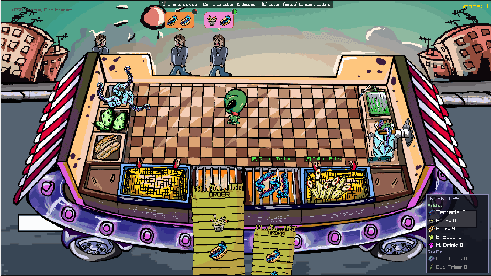
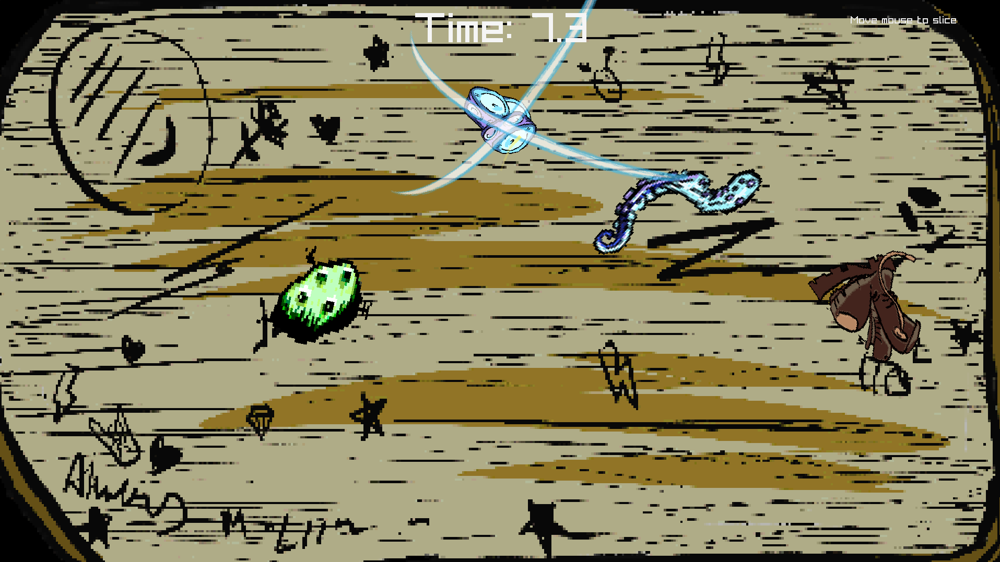
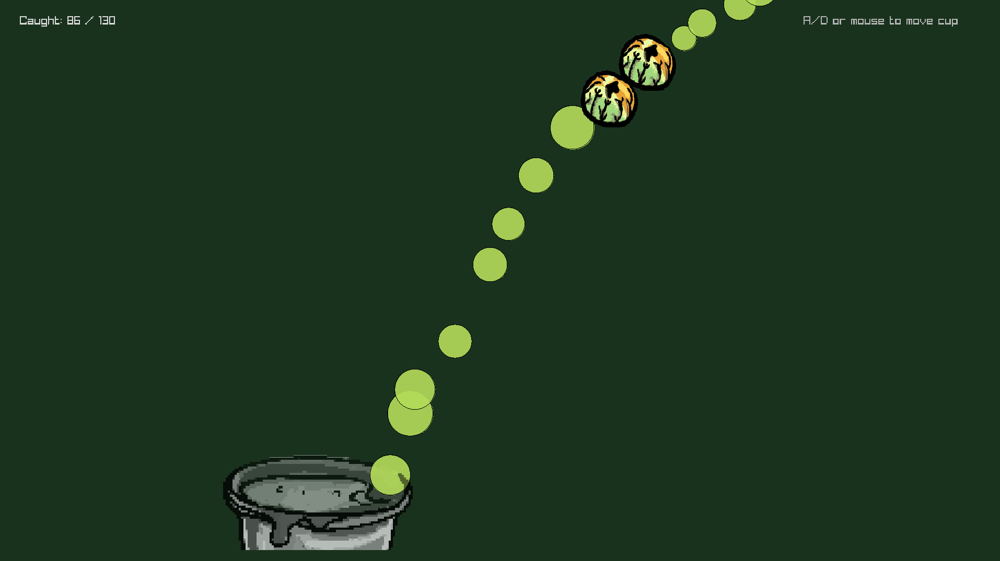

<h1 align="center">Taste from Another Place</h1>

<p align="center">
  
</p>

<p align="center">
  A top-down cooking game built in ~30 hours for a university game jam.<br>
  An extraterrestrial chef arrives on Earth after a navigational error with his food truck — and soon finds himself overwhelmed with customer orders.
</p>

<p align="center">
  <strong>🏆 1st place — CSD Game Jam Spring 2026</strong>
  &nbsp;&nbsp;|&nbsp;&nbsp;
  <a href="https://orfeasxyz.itch.io/taste-from-another-place"><strong>▶ Play on itch.io</strong></a>
</p>

---

## Preview

<p align="center">
  
</p>

<p align="center">
  
  &nbsp;&nbsp;
  
</p>

---

## About

**Theme:** Out of Place &nbsp;|&nbsp; **Restriction:** Retro pixel-art graphics &nbsp;|&nbsp; **Engine:** [Raylib](https://www.raylib.com/) + C++17

An Overcooked-style game where a single alien player must prepare and serve food to a stream of human customers. Orders arrive on a timer that ramps up as the game goes on — miss a deadline and score drops, but the game never ends. Pure score-chasing chaos.

---

## Features

- Top-down kitchen with ingredient containers, cooking stations, and a service window.
- **Cutting minigame** — fruit-ninja-style slicing timed to a 4–6 second window.
- **Drink minigame** — osu!catch-style particle catching; completion scales with how many you caught.
- **Grill & fryer** — click to cook; items can over/undercook past thresholds for a score penalty.
- Dynamic customer queue with per-order timers and bonus scoring for fast service.
- Animated alien player with directional walk cycles, animated customers.
- Background music loop and sound effects for all interactions.
- WebAssembly build playable in the browser via Emscripten.

---

## Team

Built in ~30 hours by a team of three university students.

| Name | Role |
| --- | --- |
| [Orfeas](https://github.com/orfeasxyz) | Programming |
| Marianthi ([@art.of.marianthi](https://www.instagram.com/art.of.marianthi/)) | All pixel art — drawn on a drawing tablet |
| Mike (Me) | Programming |

---


## Controls

| Action | Input |
| --- | --- |
| Move | `W` `A` `S` `D` |
| Interact (pick up / drop / use station) | `E` |
| Cutting minigame | Mouse — move to slice |
| Drink minigame | Mouse — catch falling particles |
| Navigate title screen | Mouse |

---

## Project Layout

```text
src/
  main.cpp              Entry point, game loop, state machine
  game_state.h          Shared GameState enum
  title.cpp / .h        Title screen
  kitchen.cpp / .h      Main kitchen scene
  player.cpp / .h       Player movement and inventory
  customer.cpp / .h     Customer spawning and queue logic
  orders.cpp / .h       Order/ticket system and scoring
  station.cpp / .h      Interaction stations (grill, fryer, cutting, drink)
  cutting_minigame.cpp  Fruit-ninja slice minigame
  drink_minigame.cpp    Particle-catch drink minigame
  inventory.cpp / .h    Player inventory
  audio.cpp / .h        Music and SFX wrappers
  fly_anim.cpp / .h     Animation helper

assets/
  animations/           Character walk-cycle sprite sheets
  food/                 Food item sprites
  main_screen/          Title screen art
  misc/                 Props and UI elements
  music/                Background music and jingle

shell.html              Emscripten HTML shell for web builds
Makefile                Native (Linux/WSL) and web (Emscripten) build targets
```

---

## Requirements

### Native build (Linux / WSL)

- `g++` with C++17 support
- [Raylib](https://github.com/raysan5/raylib) installed system-wide (`/usr/local`)
- Standard Linux libs: `GL`, `m`, `pthread`, `dl`, `rt`, `X11`

### Web build (Emscripten)

- [Emscripten SDK (emsdk)](https://emscripten.org/docs/getting_started/downloads.html) installed at `~/emsdk` (or update the `EMSDK` path in the Makefile)
- Raylib source cloned into `raylib/` and pre-compiled for WebAssembly:
  ```sh
  git clone https://github.com/raysan5/raylib.git raylib
  cd raylib
  mkdir build-web && cd build-web
  emcmake cmake .. -DPLATFORM=Web -DCMAKE_BUILD_TYPE=Release
  emmake make
  ```

---

## Build & Run

### Native

```sh
make
./gamejam
```

### Web (Emscripten)

```sh
make build-web
# Output is in web/index.html — serve it with any local HTTP server:
python3 -m http.server --directory web
```

Then open `http://localhost:8000` in your browser.

### Clean

```sh
make clean        # native build artifacts
make clean-web    # web build artifacts
```

---

## License

This project was made for a game jam and is shared for educational purposes.
Raylib is licensed under the [zlib License](https://github.com/raysan5/raylib/blob/master/LICENSE).
